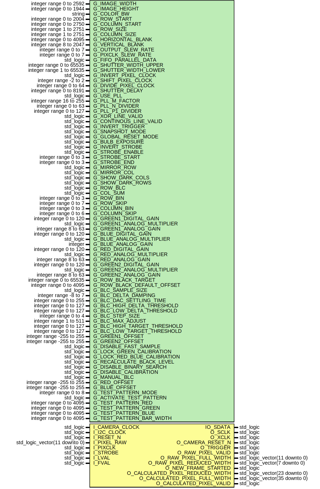

# Entity: KAMERA_CONTROLLER 
- **File**: Kamera_Controller.vhd

## Diagram

## Generics

| Generic name                | Type                      | Value   | Description                                                                                                                                                                                                                                                                                                                                                                                                                                                                                                           |
| --------------------------- | ------------------------- | ------- | --------------------------------------------------------------------------------------------------------------------------------------------------------------------------------------------------------------------------------------------------------------------------------------------------------------------------------------------------------------------------------------------------------------------------------------------------------------------------------------------------------------------- |
| G_IMAGE_WIDTH               | integer range 0 to 2592   | 1280    |                                                                                                                                                                                                                                                                                                                                                                                                                                                                                                                       |
| G_IMAGE_HEIGHT              | integer range 0 to 1944   | 960     |                                                                                                                                                                                                                                                                                                                                                                                                                                                                                                                       |
| G_COLOR_BW                  | string                    | "COLOR" |                                                                                                                                                                                                                                                                                                                                                                                                                                                                                                                       |
| G_ROW_START                 | integer range 0 to 2004   | 54      | y coordinate of the upper-left corner of the field of view. Has to be even!                                                                                                                                                                                                                                                                                                                                                                                                                                           |
| G_COLUMN_START              | integer range 0 to 2750   | 16      | x coordinate of the upper-left corner of the field of view.  The value will be rounded down to the nearest multiple of 2 times the column bin factor.                                                                                                                                                                                                                                                                                                                                                                 |
| G_ROW_SIZE                  | integer range 1 to 2751   | 1919    | The height of the field of view minus one.  Has to be odd!                                                                                                                                                                                                                                                                                                                                                                                                                                                            |
| G_COLUMN_SIZE               | integer range 1 to 2751   | 2559    | The width of the field of view minus one.  Has to be odd. It should be (2*n*(Column_Bin + 1) - 1) for some integer n.                                                                                                                                                                                                                                                                                                                                                                                                 |
| G_HORIZONTAL_BLANK          | integer range 0 to 4095   | 0       | Extra time added to the end of each row, in pixel clocks.  Incrementing this register will increase exposure and decrease frame rate.                                                                                                                                                                                                                                                                                                                                                                                 |
| G_VERTICAL_BLANK            | integer range 8 to 2047   | 8       | Extra time added to the end of each frame in rows minus one.  Incrementing this register will decrease frame rate, but not affect exposure.                                                                                                                                                                                                                                                                                                                                                                           |
| G_OUTPUT_SLEW_RATE          | integer range 0 to 7      | 7       | Controls the slew rate on digital output pads except for PIXCLK.  Higher values imply faster transition times.                                                                                                                                                                                                                                                                                                                                                                                                        |
| G_PIXCLK_SLEW_RATE          | integer range 0 to 7      | 7       | Controls the slew rate on the PIXCLK pad.  Higher values imply faster transition times.                                                                                                                                                                                                                                                                                                                                                                                                                               |
| G_FIFO_PARALLEL_DATA        | std_logic                 | '0'     | When set, pixels will be sent through the output FIFO before being sent off chip.  This allows the output port to be running at a slower speed than f_PIXCLK,  since the FIFO allows for pixels to be output during horizontal blank.  Use of this mode requires the PLL to be set up properly.                                                                                                                                                                                                                       |
| G_SHUTTER_WIDTH_UPPER       | integer range 0 to 65535  | 0       | The most significant bits of the shutter width, which are combined with Shutter Width Lower.                                                                                                                                                                                                                                                                                                                                                                                                                          |
| G_SHUTTER_WIDTH_LOWER       | integer range 1 to 65535  | 2000    | The least significant bits of the shutter width.  This is combined with Shutter_Width_Upper and Shutter_Delay for the effective shutter width.                                                                                                                                                                                                                                                                                                                                                                        |
| G_INVERT_PIXEL_CLOCK        | std_logic                 | '1'     | When set, LVAL, FVAL, and D[11:0] should be captured on the rising  edge of PIXCLK. When clear, they should be captured on the falling edge.                                                                                                                                                                                                                                                                                                                                                                          |
| G_SHIFT_PIXEL_CLOCK         | integer range -2 to 2     | 0       | Value representing how far to shift the PIXCLK output pin relative to D, in XCLKIN cycles.  Positive values shift PIXCLK later in time relative to D  (and thus relative to the internal array/datapath clock).  No effect unless PIXCLK is divided by Divide Pixel Clock.                                                                                                                                                                                                                                            |
| G_DIVIDE_PIXEL_CLOCK        | integer range 0 to 64     | 0       | Produces a PIXCLK that is divided by the value times two.  The value must be zero or a power of 2.  This will slow down the internal clock in the array control and datapath blocks, including pixel readout.  It will not affect the two-wire serial interface clock.                                                                                                                                                                                                                                                |
| G_SHUTTER_DELAY             | integer range 0 to 8191   | 0       | A negative adjustment to the effective shutter width in ACLKs. See Shutter_Width_Lower.                                                                                                                                                                                                                                                                                                                                                                                                                               |
| G_USE_PLL                   | std_logic                 | '0'     | When set, use the PLL output as the system clock.  When clear, use XCLKIN as the system clock.                                                                                                                                                                                                                                                                                                                                                                                                                        |
| G_PLL_M_FACTOR              | integer range 16 to 255   | 31      | PLL output frequency multiplier.                                                                                                                                                                                                                                                                                                                                                                                                                                                                                      |
| G_PLL_N_DIVIDER             | integer range 0 to 63     | 4       | PLL output frequency divider minus 1.                                                                                                                                                                                                                                                                                                                                                                                                                                                                                 |
| G_PLL_P1_DIVIDER            | integer range 0 to 127    | 1       | PLL system clock divider minus 1. If this is set to an even number,  the system clock duty cycle will not be 50:50.  In this case, set all bits in R101 or slow down XCLKIN.                                                                                                                                                                                                                                                                                                                                          |
| G_XOR_LINE_VALID            | std_logic                 | '0'     | When set, produce a LVAL signal that is the XOR of FVAL and the normal line_valid.                                                                                                                                                                                                                                                                                                                                                                                                                                    |
| G_CONTINOUS_LINE_VALID      | std_logic                 | '0'     | When set, produce the LVAL signal even during the vertical blank period.  When clear, produce LVAL only when active rows are being read out  (that is, only when FVAL is high).  Ineffective if FIFO_Parallel_Data is set.                                                                                                                                                                                                                                                                                            |
| G_INVERT_TRIGGER            | std_logic                 | '0'     | When set, the sense of the TRIGGER input pin will be inverted.                                                                                                                                                                                                                                                                                                                                                                                                                                                        |
| G_SNAPSHOT_MODE             | std_logic                 | '0'     | When set, the sensor enters snapshot mode, and will wait for a trigger event between frames                                                                                                                                                                                                                                                                                                                                                                                                                           |
| G_GLOBAL_RESET_MODE         | std_logic                 | '0'     | When set, the Global Reset Release shutter will be used.  When clear, the Electronic Rolling Shutter will be used.                                                                                                                                                                                                                                                                                                                                                                                                    |
| G_BULB_EXPOSURE             | std_logic                 | '0'     | When set, exposure time will be controlled by an external trigger.  When clear, exposure time will be controlled by the Shutter_Width_Lower and  Shutter_Width_Upper registers.                                                                                                                                                                                                                                                                                                                                       |
| G_INVERT_STROBE             | std_logic                 | '0'     | When set, the STROBE signal will be active LOW (during exposure).  When clear, the STROBE signal is active HIGH                                                                                                                                                                                                                                                                                                                                                                                                       |
| G_STROBE_ENABLE             | std_logic                 | '0'     | When set, a strobe signal will be generated by the digital logic during integration.  When clear, the strobe pin will be set to the value of Invert_Strobe.                                                                                                                                                                                                                                                                                                                                                           |
| G_STROBE_START              | integer range 0 to 3      | 1       | Determines the timepoint when the strobe is asserted.  0 – first trigger  1 – start of simultaneous exposure  2 – shutter width  3 – second trigger                                                                                                                                                                                                                                                                                                                                                                   |
| G_STROBE_END                | integer range 0 to 3      | 2       | Determines the timepoint when the strobe is negated.  If this is set equal to or less than Strobe_Start, the width of the strobe pulse will be t_ROW.  See Strobe_Start.                                                                                                                                                                                                                                                                                                                                              |
| G_MIRROR_ROW                | std_logic                 | '0'     | When set, row readout in the active image occurs in reverse numerical  order starting from (Row_Start + Row_Size).  When clear, row readout of the active image occurs in numerical order                                                                                                                                                                                                                                                                                                                             |
| G_MIRROR_COL                | std_logic                 | '0'     | When set, column readout in the active image occurs in reverse  numerical order, starting from (Column_Start + Column_Size).  When clear, column readout of the active image occurs in numerical order.                                                                                                                                                                                                                                                                                                               |
| G_SHOW_DARK_COLS            | std_logic                 | '0'     | When set, the dark columns will be output to the left of the active image,  making the output image wider.                                                                                                                                                                                                                                                                                                                                                                                                            |
| G_SHOW_DARK_ROWS            | std_logic                 | '0'     | When set, the dark rows will be output before the active image rows,  making the output image taller.                                                                                                                                                                                                                                                                                                                                                                                                                 |
| G_ROW_BLC                   | std_logic                 | '1'     | When set, digitally compensate for differing black levels between rows  by adding Dark Target (R73) and subtracting the average value of the 8  same-color dark pixels at the beginning of the row. When clear, digitally  add Row Black Default Offset (R75) to the value of each pixel  **turn off in test mode**                                                                                                                                                                                                   |
| G_COL_SUM                   | std_logic                 | '0'     | When set, column summing will be enabled, and in column bin modes,  all sampled capacitors will be enabled for column readout, resulting in  an effective gain equal to the column bin factor. When clear, column  averaging will be done, and there will be no additional gain related to the  column bin factor.                                                                                                                                                                                                    |
| G_ROW_BIN                   | integer range 0 to 3      | 0       | The number of rows to be read and averaged per row output minus one.                                                                                                                                                                                                                                                                                                                                                                                                                                                  |
| G_ROW_SKIP                  | integer range 0 to 7      | 1       | The number of row-pairs to skip for every row-pair output.  A value of zero means to read every row.  For Skip 2X, this should be 1; for Skip 3X, it should be 2, and so on.                                                                                                                                                                                                                                                                                                                                          |
| G_COLUMN_BIN                | integer range 0 to 3      | 0       | The number of columns to be read and averaged per column output minus one.  For normal readout, this should be zero.  For Bin 2X, it should be 1; for Bin 4X, it should be 3.                                                                                                                                                                                                                                                                                                                                         |
| G_COLUMN_SKIP               | integer range 0 to 6      | 1       | The number of column-pairs to skip for every column-pair output.  A value of zero means to read every column in the active image.  For Skip 2X, this should be 1; for Skip 3X, this should be 2, and so on.  This value should be no less than Column_Bin.  For full binning, Column_Skip should equal Column_Bin.                                                                                                                                                                                                    |
| G_GREEN1_DIGITAL_GAIN       | integer range 0 to 120    | 0       | Digital Gain for the Green1 channel minus 1 times 8.  The actual digital gain is (1 + value/8),  and can range from 1 (a setting of 0) to 16 (a setting of 120) in increments of 1/8.                                                                                                                                                                                                                                                                                                                                 |
| G_GREEN1_ANALOG_MULTIPLIER  | std_logic                 | '0'     | Analog gain multiplier for the Green1 channel minus 1.  If 1, an additional analog gain of 2x will be applied.  If 0, no additional gain is applied.                                                                                                                                                                                                                                                                                                                                                                  |
| G_GREEN1_ANALOG_GAIN        | integer range 8 to 63     | 19      | Analog gain setting for the Green1 channel times 8.  The effective gain for the channel is  (((Green1_Digital_Gain/8) + 1) * (Green1_Analog_Multiplier + 1) * (Green1_Analog_Gain/ 8)).                                                                                                                                                                                                                                                                                                                               |
| G_BLUE_DIGITAL_GAIN         | integer range 0 to 120    | 0       | Digital Gain for the Blue channel minus 1 times 8.  The actual digital gain is (1 + value/8),  and can range from 1 (a setting of 0) to 16 (a setting of  120) in increments of 1/8.                                                                                                                                                                                                                                                                                                                                  |
| G_BLUE_ANALOG_MULTIPLIER    | std_logic                 | '0'     | Analog gain multiplier for the Blue channel minus 1.  If 1, an additional analog gain of 2X will be applied. If 0, no additional gain is applied.                                                                                                                                                                                                                                                                                                                                                                     |
| G_BLUE_ANALOG_GAIN          | integer                   | 26      | Analog gain setting for the Blue channel times 8.  The effective gain for the channel is  (((Blue_Digital_Gain/8) + 1) * (Blue_Analog_Multiplier + 1) * (Blue_Analog_Gain/8)).                                                                                                                                                                                                                                                                                                                                        |
| G_RED_DIGITAL_GAIN          | integer range 0 to 120    | 0       | Digital Gain for the Red channel minus 1 times 8.  The actual digital gain is (1 + value/8)  and can range from 1 (a setting of 0) to 16  (a setting of 120) in increments of 1/8.                                                                                                                                                                                                                                                                                                                                    |
| G_RED_ANALOG_MULTIPLIER     | std_logic                 | '0'     | Analog gain multiplier for the Red channel minus 1.  If 1, an additional analog gain of 2X will be applied.  If 0, no additional gain is applied.                                                                                                                                                                                                                                                                                                                                                                     |
| G_RED_ANALOG_GAIN           | integer range 8 to 63     | 28      | Analog gain setting for the Red channel times 8.  The effective gain for the channel is  (((Red_Digital_Gain/8) + 1) * (Red_Analog_Multiplier + 1) * (Red_Analog_Gain/8)                                                                                                                                                                                                                                                                                                                                              |
| G_GREEN2_DIGITAL_GAIN       | integer range 0 to 120    | 0       | Digital Gain for the Green2 channel minus 1 times 8.  The actual digital gain is (1 + value/8)  and can range from 1 (a setting of 0) to 16 (a setting of 120) in increments of 1/8 .                                                                                                                                                                                                                                                                                                                                 |
| G_GREEN2_ANALOG_MULTIPLIER  | std_logic                 | '0'     | Analog gain multiplier for the Green2 channel minus 1.  If 1, an additional analog gain of 2x will be applied. If 0, no additional gain is applied.  Writes are synchronized to frame boundaries.                                                                                                                                                                                                                                                                                                                     |
| G_GREEN2_ANALOG_GAIN        | integer range 8 to 63     | 19      | Analog gain setting for the Green2 channel times 8.  The effective gain for the channel is  (((Green2_Digital_Gain/8) + 1) * (Green2_Analog_Multiplier + 1) * (Green2_Analog_Gain/ 8)).                                                                                                                                                                                                                                                                                                                               |
| G_ROW_BLACK_TARGET          | integer range 0 to 65535  | 424     |                                                                                                                                                                                                                                                                                                                                                                                                                                                                                                                       |
| G_ROW_BLACK_DEFAULT_OFFSET  | integer range 0 to 4095   | 0       | A two's-compliment offset digitally added to all active image pixel values  when Row BLC (R30[6]) is disabled.                                                                                                                                                                                                                                                                                                                                                                                                        |
| G_BLC_SAMPLE_SIZE           | std_logic                 | '1'     | If set, the "moving average" calculation in the BLC algorithm will use a sample size of 32.  If clear, it will use a sample size of 1  (that is, each frame's black level will be considered independent of other frames).                                                                                                                                                                                                                                                                                            |
| G_BLC_DELTA_DAMPING         | integer range -8 to 7     | 0       | A number subtracted from the calculated correction's magnitude when  in delta mode. Setting this to a positive number will correct by that much  less than the delta value. A negative number will correct by more  (possibly worsening the overshoot).  This applies to the magnitude of the delta, so a positive damping value will be subtracted  from a positive delta and added to a negative delta.                                                                                                             |
| G_BLC_DAC_SETTLING_TIME     | integer range 0 to 255    | 90      | The number of pixclks it takes for a newly set offset to take effect  divided by 2. Used to configure the fast sample algorithm.  After setting a calibration value in fast sample mode,  (value * 2) pixclks will elapse before the next sample is taken.                                                                                                                                                                                                                                                            |
| G_BLC_HIGH_DELTA_THRESHOLD  | integer range 0 to 127    | 45      | Upper delta threshold divided by 4. If the average black value for a color  is higher than this value times 4 or lower than BLC_Low_Delta_Threshold times 4,  the fast sampling and binary search modes will be activated (if enabled).  Once the black level is between the BLC_High_Delta_Threshold and the BLC_Low_Delta_Threshold,  the delta adjustment mode will be used (though fast sample mode will continue until the end of the frame).  This value should be set no lower than BLC High Target Threshold. |
| G_BLC_LOW_DELTA_THRESHOLD   | integer range 0 to 127    | 19      | Lower delta threshold divided by 4. See BLC_High_Delta_Threshold.  Should be no higher than BLC_Low_Target_Threshold.                                                                                                                                                                                                                                                                                                                                                                                                 |
| G_BLC_STEP_SIZE             | integer range 0 to 4      | 4       | Base 2 log of the change in pixel value (in LSBs) of a pixel when the  analog offset is changed by one.                                                                                                                                                                                                                                                                                                                                                                                                               |
| G_BLC_MAX_ADJUST            | integer range 1 to 511    | 511     | The maximum adjustment (positive or negative) that the BLC delta  adjustment mode is allowed to make to the analog offset.                                                                                                                                                                                                                                                                                                                                                                                            |
| G_BLC_HIGH_TARGET_THRESHOLD | integer range 0 to 127    | 35      | The upper target threshold of the BLC algorithm divided by 4.  The target black value is 4 times the average of the BLC_High_Target_Threshold  and the BLC_Low_Target_Threshold. When the black value for a color is  within these thresholds, it will be considered to be on target.                                                                                                                                                                                                                                 |
| G_BLC_LOW_TARGET_THRESHOLD  | integer range 0 to 127    | 29      | The lower target threshold for the BLC algorithm divided by 4.  See BLC High Target Threshold above.                                                                                                                                                                                                                                                                                                                                                                                                                  |
| G_GREEN1_OFFSET             | integer range -255 to 255 | 32      | Representation of the analog offset value for Green1. If Manual_BLC (R98[0])  is set, this value will be used as the analog offset. Otherwise, the value may be overridden by  the BLC algorithm. When read, this register returns the offset currently in use.  The user-programmed value is always retained internally, and may be read by setting Manual_BLC.                                                                                                                                                      |
| G_GREEN2_OFFSET             | integer range -255 to 255 | 32      | See Green 1 offset.                                                                                                                                                                                                                                                                                                                                                                                                                                                                                                   |
| G_DISABLE_FAST_SAMPLE       | std_logic                 | '0'     | When set, the fast sampling mode (multiple samples per frame) will not  be used if the black level falls outside the delta thresholds; instead, only  one sample-adjust will take place per frame. Binary search mode may  still be used. When clear, fast sample mode will be used when necessary.                                                                                                                                                                                                                   |
| G_LOCK_GREEN_CALIBRATION    | std_logic                 | '0'     | When set, the calibration offset chosen for Green1 will be used for  Green2 pixels as well. Only effective if Green1_Analog_Gain equals  Green2_Analog_Gain and Green1_Analog_Multiplier equals Green2_Analog_Multiplier.                                                                                                                                                                                                                                                                                             |
| G_LOCK_RED_BLUE_CALIBRATION | std_logic                 | '0'     | When set, the calibration offset chosen for Red will be used for Blue  pixels as well. Only effective if Red_Analog_Gain equals  Blue_Analog_Gain and Red_Analog_Multiplier equals Blue_Analog_Multiplier.                                                                                                                                                                                                                                                                                                            |
| G_RECALCULATE_BLACK_LEVEL   | std_logic                 | '0'     | When set, any running averages will be reset and the fast sample and  binary search modes will be activated (if enabled).                                                                                                                                                                                                                                                                                                                                                                                             |
| G_DISABLE_BINARY_SEARCH     | std_logic                 | '0'     | When set, binary search mode will not be used when the black level falls  outside the delta thresholds; instead the delta mode will be used.  Fast sampling mode may still be used if enabled.                                                                                                                                                                                                                                                                                                                        |
| G_DISABLE_CALIBRATION       | std_logic                 | '0'     | When set, analog calibration is disabled.  When clear, the programmed or automatic offsets will be used.                                                                                                                                                                                                                                                                                                                                                                                                              |
| G_MANUAL_BLC                | std_logic                 | '0'     | When set, the user programmed calibration offsets from R96-R97 and  R99-R100 will be used. Also, black level calculation will be disabled.  When clear, the BLC algorithm will adjust the offsets to maintain the  target black level. Issue a Restart after clearing this register to avoid  updating offsets based on corrupt black rows.  If this bit is 1, Show_Dark_Rows must be set to allow channel offset  correction to function properly.                                                                   |
| G_RED_OFFSET                | integer range -255 to 255 | 32      | Representation of the analog offset value for Red.  See Green1_Offset. Writes are synchronized to frame boundaries.                                                                                                                                                                                                                                                                                                                                                                                                   |
| G_BLUE_OFFSET               | integer range -255 to 255 | 32      | Representation of the analog offset value for Blue. See Green1_Offset.                                                                                                                                                                                                                                                                                                                                                                                                                                                |
| G_TEST_PATTERN_MODE         | integer range 0 to 8      | 1       | Sets the test pattern mode, see docs for details.                                                                                                                                                                                                                                                                                                                                                                                                                                                                     |
| G_ACTIVATE_TEST_PATTERN     | std_logic                 | '0'     | use test pattern or real image                                                                                                                                                                                                                                                                                                                                                                                                                                                                                        |
| G_TEST_PATTERN_RED          | integer range 0 to 4095   | 1000    | used value for red in test mode                                                                                                                                                                                                                                                                                                                                                                                                                                                                                       |
| G_TEST_PATTERN_GREEN        | integer range 0 to 4095   | 2000    | used value for green in test mode                                                                                                                                                                                                                                                                                                                                                                                                                                                                                     |
| G_TEST_PATTERN_BLUE         | integer range 0 to 4095   | 3000    | used value for blue in test mode                                                                                                                                                                                                                                                                                                                                                                                                                                                                                      |
| G_TEST_PATTERN_BAR_WIDTH    | integer range 0 to 4095   | 25      | width of the bar in mode 6 and 7                                                                                                                                                                                                                                                                                                                                                                                                                                                                                      |

## Ports

| Port name                        | Direction | Type                          | Description              |
| -------------------------------- | --------- | ----------------------------- | ------------------------ |
| I_CAMERA_CLOCK                   | in        | std_logic                     | In clock - max 96MHz     |
| I_I2C_CLOCK                      | in        | std_logic                     | Clock für i2c Controller |
| I_RESET_N                        | in        | std_logic                     |                          |
| I_PIXEL_RAW                      | in        | std_logic_vector(11 downto 0) |                          |
| I_PIXCLK                         | in        | std_logic                     |                          |
| I_STROBE                         | in        | std_logic                     |                          |
| I_LVAL                           | in        | std_logic                     |                          |
| I_FVAL                           | in        | std_logic                     |                          |
| IO_SDATA                         | inout     | std_logic                     |                          |
| O_SCLK                           | out       | std_logic                     |                          |
| O_XCLK                           | out       | std_logic                     |                          |
| O_CAMERA_RESET_N                 | out       | std_logic                     |                          |
| O_TRIGGER                        | out       | std_logic                     |                          |
| O_RAW_PIXEL_VALID                | out       | std_logic                     |                          |
| O_RAW_PIXEL_FULL_WIDTH           | out       | std_logic_vector(11 downto 0) |                          |
| O_RAW_PIXEL_REDUCED_WIDTH        | out       | std_logic_vector(7 downto 0)  |                          |
| O_NEW_FRAME_STARTED              | out       | std_logic                     |                          |
| O_CALCULATED_PIXEL_REDUCED_WIDTH | out       | std_logic_vector(23 downto 0) |                          |
| O_CALCULATED_PIXEL_FULL_WIDTH    | out       | std_logic_vector(35 downto 0) |                          |
| O_CALCULATED_PIXEL_VALID         | out       | std_logic                     |                          |

## Signals

| Name                              | Type                          | Description |
| --------------------------------- | ----------------------------- | ----------- |
| r_lval                            | std_logic                     |             |
| r_fval                            | std_logic                     |             |
| r_raw_pixel                       | std_logic_vector(11 downto 0) |             |
| r_current_state                   | t_states                      |             |
| w_next_state                      | t_states                      |             |
| r_state_count                     | integer range 0 to 500        |             |
| w_start_camera_configuration      | std_logic                     |             |
| o_camera_reset_n_s                | std_logic                     |             |
| w_configuration_finished          | std_logic                     |             |
| r_camera_reset_n                  | std_logic                     |             |
| w_image_capture_reset_n           | std_logic                     |             |
| w_raw2rgb_pixel_out               | std_logic_vector(35 downto 0) |             |
| w_raw2rgb_pixel_reduced_width_out | std_logic_vector(23 downto 0) |             |
| w_raw2rgb_pixel_out_valid         | std_logic                     |             |
| w_raw2rgb_reset_n                 | std_logic                     |             |
| w_captured_pixel                  | std_logic_vector(11 downto 0) |             |
| w_captured_pixel_valid            | std_logic                     |             |
| w_new_frame_started               | std_logic                     |             |
| r_init_count                      | integer range 0 to 500        |             |
| r_camera_ready                    | std_logic                     |             |

## Types

| Name     | Type                                                                                                                                                                                                        | Description |
| -------- | ----------------------------------------------------------------------------------------------------------------------------------------------------------------------------------------------------------- | ----------- |
| t_states | ( CAMERA_INIT,  CAMERA_WAIT_FOR_NEW_FRAME,  CAMERA_READY_OUTER_FRAME,  CAMERA_READY_ACTIVE_IMAGE ) |             |

## Processes
- proc_init_count: ( I_RESET_N, I_CAMERA_CLOCK )
- PROC_CAMERA_INIT_RESET: ( I_RESET_N, I_CAMERA_CLOCK )
- PROC_CAPTURE_INPUT: ( I_RESET_N, I_CAMERA_CLOCK )

## Instantiations

- COMP_RAW2RGB: RAW2RGB
- COMP_IMAGE_CAPTURE: IMAGE_CAPTURE
- COMP_CAMERA_CONFIGURATOR: CAMERA_CONFIGURATOR
